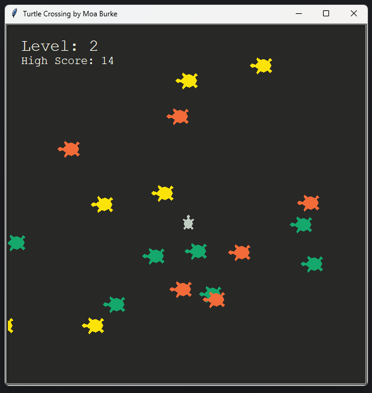

# Turtle Crossing Game

## Description
The Turtle Crossing Game is a fun and interactive game where players control a turtle trying to cross a road filled with moving turtle obstacles.



## Classes

### Player Class
- Handles the player’s turtle movement on the screen.
- Moves forward and backward based on keyboard input.
- Resets to the starting position when needed.
- Checks if the turtle has successfully crossed the finish line.

### Scoreboard Class
- Displays the current level and high score on the screen.
- Updates the scoreboard whenever the player crosses the finish line.
- Increases the level after successful crossings.
- Saves the new high score to a file if the player surpasses it.
- Displays game over messages and restart instructions when the game ends.

### Game Class
- Manages the overall game logic and flow.
- Initializes the player and scoreboard classes.
- Contains the main game loop that checks for player inputs.
- Handles collisions with turtle obstacles and manages game-over conditions.


## Installation
To run this project, ensure you have Python installed on your computer. You can download Python from [python.org](https://www.python.org/).

### Clone the Repository
```bash
git clone https://github.com/moaburke/TurtleCrossingGame.git
cd TurtleCrossingGame
```

## Usage

1. **Open the Terminal and navigate to project directory.** (Command Prompt or any terminal of your choice).

2. **Run the Game:**
   - Execute the game using the command:
     ```bash
     python main.py
     ```
   - If you receive an error indicating that Python is not recognized, ensure Python is installed and added to your PATH. You can verify by running `python --version`.

3. **Controls:**
   - Use the W **Up Arrow** (up) and **Down Arrow** (down) keys to move the turtle up and down.
   - Successfully cross the road to increase your level.

## Game Logic
- The player’s turtle resets to the starting position after a successful crossing.
- The level increases with each successful crossing, enhancing gameplay.
- Players can restart the game by pressing the Space bar.
- The game can be exited by pressing the Esc key.
